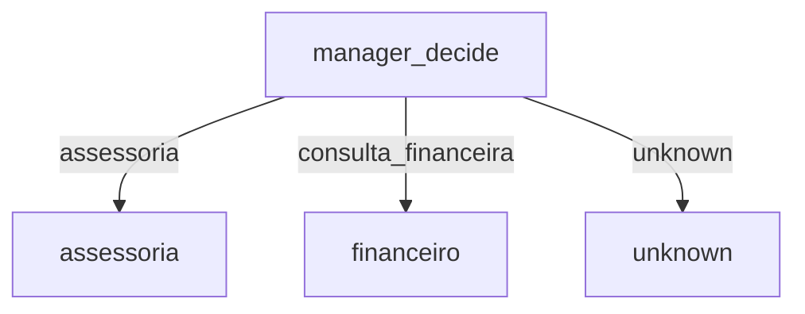

# MCP Agents Playground

Orquestrador de agentes (Manager Agent) com FastAPI + LangChain + LangGraph.

## Visão Geral

O sistema expõe uma API REST que:
1. Recebe uma intenção de usuário.
2. Usa um Manager Agent para decidir qual agente especializado deve ser acionado.
3. Executa o agente escolhido (ex.: `assessoria`, `consulta_financeira`).
4. Opcionalmente orquestra o fluxo via **LangGraph** (estado, roteamento condicional, extensibilidade).

## Arquitetura

```
Cliente -> FastAPI (/execute ou /graph/execute)
							|
							v
				Manager (decide_agent)
							|
				+-----+------------------+
				|                        |
				v                        v
	Agente Assessoria       Agente Financeiro
```

Com LangGraph:



## Requisitos

- Python 3.11+
- Chave OpenAI (`OPENAI_API_KEY`) em `.env`

## Setup Rápido

```bash
python3 -m venv .venv
source .venv/bin/activate
pip install -r requirements.txt
cp .env.example .env  # (se você criar um .env.example)
uvicorn app.main:app --reload
```

## Variáveis de Ambiente

Criar arquivo `.env`:

```
OPENAI_API_KEY=sk-...
```

## Endpoints

| Método | Rota              | Descrição                                      |
|--------|-------------------|------------------------------------------------|
| POST   | `/route`          | Só roteia (debug)                              |
| POST   | `/execute`        | Roteia e executa agente                        |
| POST   | `/graph/execute`  | Executa via LangGraph                          |
| GET    | `/graph/mermaid`  | Retorna diagrama Mermaid do fluxo              |
| GET    | `/docs`           | Swagger UI                                     |

### Exemplo: Roteamento simples

```bash
curl -s -X POST http://127.0.0.1:8000/route \
	-H 'Content-Type: application/json' \
	-d '{"user_intent":"preciso de ajuda com investimentos"}' | jq
```

### Execução completa

```bash
curl -s -X POST http://127.0.0.1:8000/execute \
	-H 'Content-Type: application/json' \
	-d '{"user_intent":"preciso de ajuda com investimentos"}' | jq
```

### Execução com LangGraph

```bash
curl -s -X POST http://127.0.0.1:8000/graph/execute \
	-H 'Content-Type: application/json' \
	-d '{"user_intent":"preciso de ajuda com investimentos"}' | jq
```

### Diagrama do fluxo

```bash
curl -s http://127.0.0.1:8000/graph/mermaid | jq -r .mermaid
```

Cole o output em https://mermaid.live para visualizar.

## Extensão: Adicionar Novo Agente

1. Criar arquivo em `app/agents/<novo_agente>_agent.py` com função `run_<novo_agente>_agent`.
2. Registrar em `app/agents/registry.py`:

```python
AGENT_REGISTRY["novo_agente"] = run_novo_agente_agent
```
3. Ajustar lógica de decisão no Manager (prompt ou heurística de fallback) para usar o novo nome.
4. (Opcional) Adicionar novo nó no grafo em `orchestration/graph.py`.

## Testes (Sugerido)

Adicionar `pytest` e criar testes para:
- `decide_agent` fallback.
- Execução de cada agente com mock do LLM.
- Orquestração via LangGraph (com monkeypatch do manager / registry).

## Próximos Passos Sugeridos

- Logging estruturado (ex.: `structlog`).
- Cache de decisões (Redis) se volume alto.
- Rate limiting / auth.
- Observabilidade (Prometheus + métricas de latência e taxa de fallback).
- Migração para LangGraph mais rica (loops, ferramentas externas, memory state incrementando contexto).

---
MIT License.